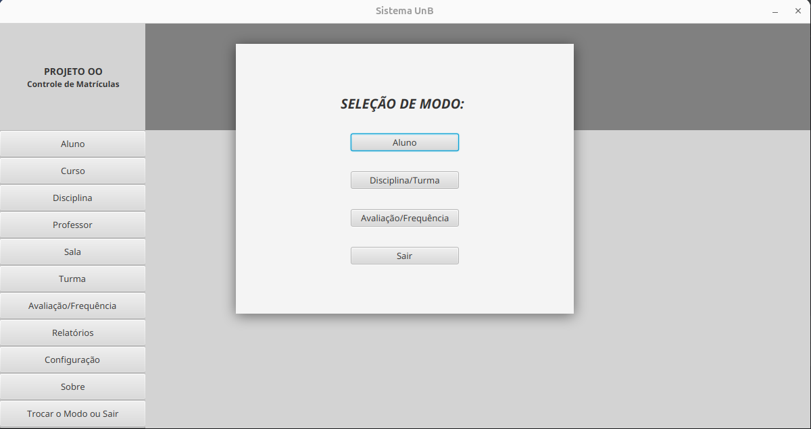
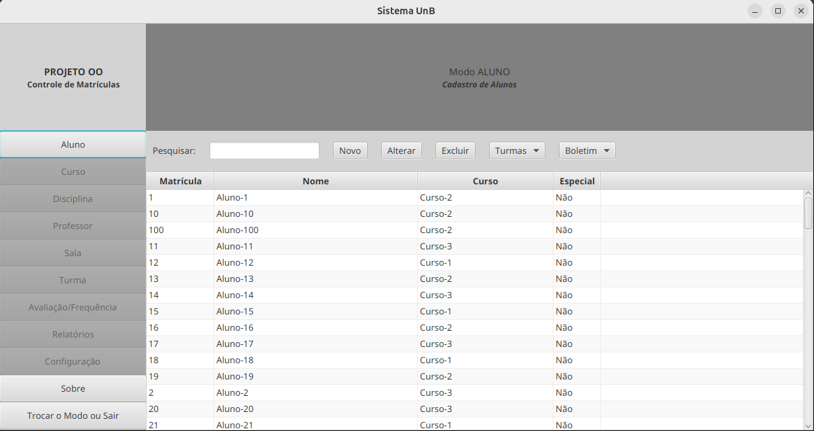
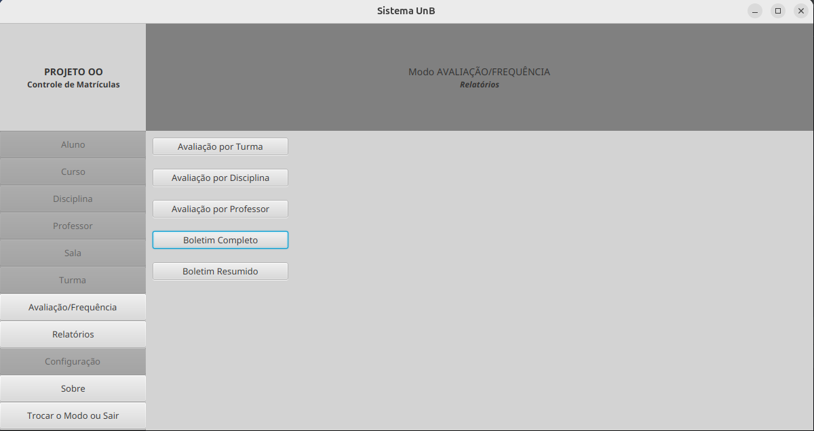

# Sistema Acadêmico - FCTE

## Descrição do Projeto

Desenvolvimento de um sistema acadêmico para gerenciar alunos, disciplinas, professores, turmas, avaliações e frequência, utilizando os conceitos de orientação a objetos (herança, polimorfismo e encapsulamento) e persistência de dados em arquivos.

O enunciado do trabalho pode ser encontrado aqui:
- [Trabalho 1 - Sistema Acadêmico](https://github.com/lboaventura25/OO-T06_2025.1_UnB_FCTE/blob/main/trabalhos/ep1/README.md)

## Dados do Aluno

- **Nome completo:** [Tomás Garcia Rocho]
- **Matrícula:** [242024988]
- **Curso:** [Engenharias]
- **Turma:** [FGA0158 -ORIENTAÇÃO A OBJETOS- T06]

---

## Instruções para Compilação e Execução

1. **Compilação:**  
   [Foi utilizado o Maven como gerador de build, então é necessário que a máquina possua além do JDK, também o Maven instalado.
Para compilar é necessário ir para pasta do projeto(MatriculaUnb) e executar o comando "mvn install"]

2. **Execução:**  
   [mvn clean javafx:run]

3. **Estrutura de Pastas:**  
   [
    ->MatriculaUnb(Pasta raiz do projeto, contém o pom.xml que configura as dependências do projeto
 
    --->src.main.java.com.tomas.matriculaunb.modelo(Classes dos objetos do modelo de dados)

    --->src.main.java.com.tomas.matriculaunb.servicos(Classes que manipulam as listas dos objetos do modelo de dados)

    --->src.main.java.com.tomas.matriculaunb.util(Classes utilitárias em geral)

    --->src.main.java.com.tomas.matriculaunb.controllersJavaFX(Classes necessárias para o controle das interfaces javafx)

    --->src.main.resources.com.tomas.matriculaunb.controllersJavaFX(Definição das telas javafx)

    --->dados(Pasta que irá armazenar os arquivos que contém os dados em formato json)
]

3. **Versão do JAVA utilizada:**  
   [java 21]

---

## Vídeo de Demonstração

- [Vídeo de explicação](https://drive.google.com/file/d/1ytxoi0fVLkOM3QslYfzHB0G2KGKNzdBH/view?usp=sharing)

---

## Prints da Execução

1. Menu Principal:  
   

2. Cadastro de Aluno:  
   

3. Relatório de Frequência/Notas:  
   

---

## Principais Funcionalidades Implementadas

- [x] Cadastro, listagem, matrícula e trancamento de alunos (Normais e Especiais)
- [x] Cadastro de disciplinas e criação de turmas (presenciais e remotas)
- [x] Matrícula de alunos em turmas, respeitando vagas e pré-requisitos
- [x] Lançamento de notas e controle de presença
- [x] Cálculo de média final e verificação de aprovação/reprovação
- [x] Relatórios de desempenho acadêmico por aluno, turma e disciplina
- [x] Persistência de dados em arquivos (.txt ou .csv)
- [x] Tratamento de duplicidade de matrículas
- [x] Uso de herança, polimorfismo e encapsulamento

---

## Observações (Extras ou Dificuldades)

- [Projeto desenvolvido em Java utilizando o framework Javafx para definição de interface gráfica. Os dados foram persistidos em formato
 json e os relatórios em formato HTML.
    Dificuldades : aprender interfaces gráficas, melhor eficiência de código, aprender a trabalhar com arquivos json e HTML]

---

## Contato

- [tomasgarciarocho@gmail.com]
